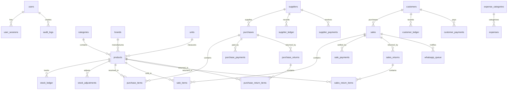
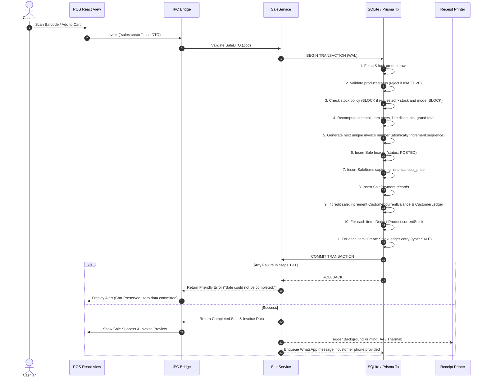

# RS Inventory – Solo: Architectural Blueprint & Implementation Plan

**Product:** RS Inventory – Solo  
**Company:** RS ORANGE TECH PVT LTD  
**System Type:** Enterprise-grade Windows Desktop POS & Inventory Management Application  
**Architecture:** Offline-First Modular Monolith  
**Core Technologies:** Electron, Node.js, React, TypeScript, Prisma ORM, SQLite (WAL mode), Tailwind CSS, electron-builder  

---

## Executive Summary & System Tenets

RS Inventory – Solo is engineered as a commercial, standalone desktop POS and inventory management system designed for independent retail shops. It enforces strict local-first autonomy: **every core operation (POS billing, barcode scanning, stock ledger accounting, purchase recording, returns, customer/supplier ledgers, expenses, reports, receipt printing, and database backups) operates with zero dependency on network availability or cloud infrastructure.**

### Core System Tenets
1. **Offline-First Non-Negotiable:** Internet connectivity is an optional luxury reserved solely for external gateways (WhatsApp invoice delivery, license validation, updates, cloud backups). A network disconnection or remote server timeout will never fail, delay, or invalidate a local sale or transaction.
2. **Double-Entry Stock Auditability:** `products.current_stock` is strictly a read-performance cache. Every stock movement is immutably recorded in `stock_ledger`. Cache balance and reconstructed ledger balance are strictly identical invariants.
3. **Atomic Financial Boundaries:** POS sales, purchases, returns, stock adjustments, customer/supplier settlements, and sequence updates execute within isolated SQLite atomic transactions. No partial records or orphaned child items can ever exist.
4. **Historical Immutability:** Historical profit is permanently fixed at the time of sale by capturing `sale_items.cost_price`. Historical records are never retroactively recalculated using present-day purchase prices.
5. **Zero Trust Renderer Boundary:** React operates in an isolated sandbox (`contextIsolation: true`, `nodeIntegration: false`). No direct database, filesystem, or Node OS primitives are exposed to the UI. All operations traverse strongly-typed, schema-validated IPC handlers.

---

## User Review Required

> [!IMPORTANT]
> **Database Engine & Concurrency Policy:**
> SQLite operates in Single-Writer mode. To eliminate database locking (`SQLITE_BUSY`) during fast-paced POS scanning and simultaneous background tasks (e.g. backup or reporting), the database will be configured with **WAL (Write-Ahead Logging)** mode, a 5000ms busy timeout, and a sequential async transaction mutex queue in the main process Node.js service layer.

> [!WARNING]
> **Barcode Scanner Interaction Standard:**
> Hardware USB barcode scanners typically act as HID (Human Interface Device) keyboards emitting keystrokes followed by `Enter`. The POS interface incorporates a global scanner interceptor hook with keystroke delta timing (<50ms between characters) to automatically route scanned barcodes to the cart even when an input field is not explicitly focused.

---

## A. System Architecture

```text
+------------------------------------------------------------------------------------+
|                                  ELECTRON SHELL                                    |
|                                                                                    |
|  +------------------------------------------------------------------------------+  |
|  |                           REACT RENDERER PROCESS                             |  |
|  |  (Sandboxed, contextIsolation: true, nodeIntegration: false, Strict Content) |  |
|  |                                                                              |  |
|  |   Tailwind CSS Design System + Lucide Icons + React Router + TanStack Query  |  |
|  |   State: Zustand (POS Cart, Auth Session, Active View, Global Modals)         |  |
|  |   Features: POS Cashier, Products, Stock Ledger, Purchases, Customers, etc.  |  |
|  +------------------------------------------------------------------------------+  |
|                                        |                                           |
|                                        | window.electronAPI (Strict Bridge)         |
|                                        v                                           |
|  +------------------------------------------------------------------------------+  |
|  |                                PRELOAD BRIDGE                                |  |
|  |   contextBridge.exposeInMainWorld('electronAPI', { ...typedMethods })        |  |
|  +------------------------------------------------------------------------------+  |
|                                        |                                           |
|                                        | ipcRenderer.invoke / ipcMain.handle       |
|                                        v                                           |
|  +------------------------------------------------------------------------------+  |
|  |                             NODE.JS MAIN PROCESS                             |  |
|  |                                                                              |  |
|  |   [IPC Router & DTO Validators (Zod)]                                        |  |
|  |        │                                                                     |  |
|  |        ├── [Security & Auth Guard (Argon2id/bcrypt, Session tokens)]        |  |
|  |        │                                                                     |  |
|  |        ├── [Domain Services (Modular Monolith)]                             |  |
|  |        │     ├── AuthService         ├── ProductService                      |  |
|  |        │     ├── SaleService         ├── PurchaseService                     |  |
|  |        │     ├── InventoryService    ├── CustomerService                     |  |
|  |        │     ├── SupplierService     ├── ReturnService                       |  |
|  |        │     ├── ExpenseService      ├── ReportService                       |  |
|  |        │     ├── InvoiceService      ├── SettingsService                     |  |
|  |        │     └── AuditService                                                |  |
|  |        │                                                                     |  |
|  |        ├── [System Infrastructure Services]                                 |  |
|  |        │     ├── NativePrintService (A4 / 58mm / 80mm ESC/POS / Chromium)    |  |
|  |        │     ├── PdfGeneratorService                                         |  |
|  |        │     ├── BackupRestoreService (ZIP, SHA-256 Checksum, Wal Check)     |  |
|  |        │     ├── WhatsAppQueueService (Offline queue, retry worker)          |  |
|  |        │     ├── LicenseService (Local hardware-bound signature check)       |  |
|  |        │     └── StructuredLogger (Winston / Pino daily rotating files)      |  |
|  |        │                                                                     |  |
|  |        └── [Data Access Layer: Repositories & Prisma ORM]                   |  |
|  |                   │                                                          |  |
|  |                   v                                                          |  |
|  |             PRISMA CLIENT (Transactions, Prepared Queries)                    |  |
|  |                   │                                                          |  |
|  +-------------------|----------------------------------------------------------+  |
|                      v                                                             |
|           +---------------------+                                                  |
|           |   SQLite DATABASE   |                                                  |
|           | (WAL Mode, PRAGMA)  |                                                  |
|           +---------------------+                                                  |
+------------------------------------------------------------------------------------+
```

---

## B. Complete Project Folder Structure

```text
s:/InventryPilot/
├── .github/                      # Workflows for CI, automated tests, and build
├── docs/                         # Full architecture, DB schema, IPC contract docs
│   ├── architecture.md
│   ├── database.md
│   ├── ipc-api.md
│   ├── deployment-windows.md
│   └── disaster-recovery.md
├── prisma/
│   ├── schema.prisma             # Complete Prisma schema definition
│   ├── migrations/               # Immutable versioned migration files
│   └── seed.ts                   # Initial seed (default tax, units, Cash Customer)
├── resources/                    # App icons, sample receipts, Windows installer assets
│   ├── icon.ico
│   ├── icon.png
│   └── installer/
├── src/
│   ├── main/                     # Node.js Electron Main Process
│   │   ├── index.ts              # Electron lifecycle, window creation, startup checks
│   │   ├── config/               # App configuration, directory paths, environment
│   │   ├── database/             # Prisma client instance, WAL pragmas, runMigrations
│   │   ├── ipc/                  # IPC handlers grouped by domain
│   │   │   ├── auth.ipc.ts
│   │   │   ├── product.ipc.ts
│   │   │   ├── sale.ipc.ts
│   │   │   ├── purchase.ipc.ts
│   │   │   ├── inventory.ipc.ts
│   │   │   ├── customer.ipc.ts
│   │   │   ├── supplier.ipc.ts
│   │   │   ├── return.ipc.ts
│   │   │   ├── expense.ipc.ts
│   │   │   ├── report.ipc.ts
│   │   │   ├── settings.ipc.ts
│   │   │   ├── backup.ipc.ts
│   │   │   ├── print.ipc.ts
│   │   │   └── audit.ipc.ts
│   │   ├── modules/              # Modular Monolith Domain Services & Repositories
│   │   │   ├── auth/
│   │   │   │   ├── auth.service.ts
│   │   │   │   ├── session.manager.ts
│   │   │   │   └── password.hasher.ts
│   │   │   ├── products/
│   │   │   │   ├── product.service.ts
│   │   │   │   ├── product.repository.ts
│   │   │   │   └── category-brand.service.ts
│   │   │   ├── inventory/
│   │   │   │   ├── inventory.service.ts
│   │   │   │   ├── stock-ledger.repository.ts
│   │   │   │   └── stock-reconciliation.ts
│   │   │   ├── sales/
│   │   │   │   ├── sale.service.ts
│   │   │   │   ├── sale.repository.ts
│   │   │   │   └── invoice-sequence.service.ts
│   │   │   ├── purchases/
│   │   │   │   ├── purchase.service.ts
│   │   │   │   └── purchase.repository.ts
│   │   │   ├── returns/
│   │   │   │   ├── sales-return.service.ts
│   │   │   │   └── purchase-return.service.ts
│   │   │   ├── customers/
│   │   │   │   ├── customer.service.ts
│   │   │   │   └── customer-ledger.repository.ts
│   │   │   ├── suppliers/
│   │   │   │   ├── supplier.service.ts
│   │   │   │   └── supplier-ledger.repository.ts
│   │   │   ├── expenses/
│   │   │   │   └── expense.service.ts
│   │   │   ├── reports/
│   │   │   │   ├── report.service.ts
│   │   │   │   └── export.service.ts
│   │   │   ├── printing/
│   │   │   │   ├── print.service.ts
│   │   │   │   ├── a4-invoice.builder.ts
│   │   │   │   └── thermal-receipt.builder.ts
│   │   │   ├── backup/
│   │   │   │   ├── backup.service.ts
│   │   │   │   ├── restore.service.ts
│   │   │   │   └── scheduler.ts
│   │   │   ├── settings/
│   │   │   │   └── settings.service.ts
│   │   │   ├── audit/
│   │   │   │   └── audit.service.ts
│   │   │   └── online/
│   │   │       ├── whatsapp-queue.worker.ts
│   │   │       ├── license.client.ts
│   │   │       └── updater.service.ts
│   │   ├── system/               # OS integration: paths, hardware ID, printer list
│   │   ├── logging/              # Structured logger with file rotation & sanitization
│   │   └── security/             # Payload sanitization, rate limiters, crypto utilities
│   ├── preload/                  # Electron Preload Scripts
│   │   ├── index.ts              # contextBridge exposing window.electronAPI
│   │   └── types.ts              # Strongly-typed Preload API definition
│   ├── renderer/                 # React 18 / 19 Application (Vite + TypeScript)
│   │   ├── index.html
│   │   ├── src/
│   │   │   ├── App.tsx           # Router, Root Context Providers, Layout
│   │   │   ├── main.tsx          # Renderer entry point
│   │   │   ├── assets/           # UI styling tokens, SVGs, base CSS
│   │   │   ├── components/       # Enterprise UI Component Library
│   │   │   │   ├── common/       # Button, Input, Modal, Badge, Card, Table, Toast
│   │   │   │   ├── layout/       # Sidebar, TopNav, StatusHeader, KeyIndicator
│   │   │   │   └── forms/        # FormField, CurrencyInput, BarcodeInput
│   │   │   ├── features/         # Screen Views & Feature Modules
│   │   │   │   ├── setup/        # First-run 8-step wizard
│   │   │   │   ├── auth/         # Login & session lockout screen
│   │   │   │   ├── dashboard/    # KPI metrics, low-stock alerts, quick actions
│   │   │   │   ├── pos/          # POS Screen (Instant Cart, Scanning, Split Pay)
│   │   │   │   ├── products/     # Master Product, Category, Brand, Unit CRUD
│   │   │   │   ├── inventory/    # Stock Summary, Ledger View, Manual Adjustments
│   │   │   │   ├── purchases/    # Purchase Order Creation, Supplier Receiving
│   │   │   │   ├── returns/      # Sale Return & Purchase Return workflows
│   │   │   │   ├── customers/    # Customer Directory, Ledger, Payment Collection
│   │   │   │   ├── suppliers/    # Supplier Directory, Ledger, Supplier Payouts
│   │   │   │   ├── expenses/     # Expense Recording & Category Breakdown
│   │   │   │   ├── reports/      # Sales, Tax/GST, Profit, Stock, Ledgers
│   │   │   │   ├── settings/     # Company, Invoice, Printer, Backup, POS Policy
│   │   │   │   └── maintenance/  # DB Integrity, Backup & Restore, Audit Logs
│   │   │   ├── hooks/            # Keyboard navigation, Barcode scanner listener
│   │   │   ├── stores/           # Zustand stores (Cart, Session, Theme, Settings)
│   │   │   └── utils/            # Currency formatters, date utilities, printers
│   ├── shared/                   # Shared TypeScript Types, Zod Schemas & Constants
│   │   ├── types/                # Domain models, IPC request/response types
│   │   ├── schemas/              # Zod validation schemas for all entities & forms
│   │   ├── constants/            # Default settings, payment modes, ledger types
│   │   └── errors/               # Standardized application error codes & classes
├── tests/
│   ├── unit/                     # Unit tests for calculations, Zod, stock rules
│   ├── integration/              # Prisma transaction & repository integration tests
│   └── e2e/                      # Playwright / Spectron E2E desktop workflows
├── package.json
├── electron-builder.yml          # Windows NSIS packaging configuration
├── tsconfig.json
├── vite.config.ts
└── tailwind.config.js
```

---

## C. Database ERD & Entity Relationships

The database is built on **SQLite (WAL mode)** using **Prisma ORM**. All monetary amounts are stored as integers (representing paisa / cents) or exact decimals to eliminate binary IEEE 754 floating-point inaccuracies.

### Entity Relationship Diagram (Mermaid)



### Complete Entity Definitions

```prisma
datasource db {
  provider = "sqlite"
  url      = "file:./data/rs_inventory.db"
}

generator client {
  provider = "prisma-client-js"
}

enum Role {
  ADMIN
  CASHIER
  MANAGER
}

enum Status {
  ACTIVE
  INACTIVE
}

enum StockTransactionType {
  OPENING
  PURCHASE
  SALE
  RETURN_IN
  RETURN_OUT
  ADJUSTMENT_IN
  ADJUSTMENT_OUT
}

enum PaymentMethod {
  CASH
  CARD
  UPI
  BANK_TRANSFER
  CREDIT
}

enum TransactionStatus {
  DRAFT
  POSTED
  CANCELLED
}

enum WhatsAppStatus {
  PENDING
  SENDING
  SENT
  FAILED
  CANCELLED
}

// ----------------------------------------------------
// AUTH & AUDIT
// ----------------------------------------------------

model User {
  id           String        @id @default(uuid())
  username     String        @unique
  passwordHash String
  fullName     String
  role         Role          @default(ADMIN)
  status       Status        @default(ACTIVE)
  createdAt    DateTime      @default(now())
  updatedAt    DateTime      @updatedAt
  sessions     UserSession[]
  auditLogs    AuditLog[]

  @@map("users")
}

model UserSession {
  id           String    @id @default(uuid())
  userId       String
  token        String    @unique
  expiresAt    DateTime
  lastActiveAt DateTime  @default(now())
  createdAt    DateTime  @default(now())
  user         User      @relation(fields: [userId], references: [id], onDelete: Cascade)

  @@map("user_sessions")
}

model AuditLog {
  id         String   @id @default(uuid())
  userId     String?
  action     String   // e.g., "SALE_CREATE", "STOCK_ADJUST", "INVOICE_CANCEL", "DB_RESTORE"
  entityType String   // "Sale", "Product", "Settings", etc.
  entityId   String?
  oldValue   String?  // JSON stringified diff
  newValue   String?  // JSON stringified diff
  reason     String?
  createdAt  DateTime @default(now())
  user       User?    @relation(fields: [userId], references: [id], onDelete: SetNull)

  @@index([createdAt])
  @@index([entityType, entityId])
  @@map("audit_logs")
}

// ----------------------------------------------------
// PRODUCT CATALOG
// ----------------------------------------------------

model Category {
  id          String    @id @default(uuid())
  name        String    @unique
  description String?
  status      Status    @default(ACTIVE)
  createdAt   DateTime  @default(now())
  updatedAt   DateTime  @updatedAt
  products    Product[]

  @@map("categories")
}

model Brand {
  id        String    @id @default(uuid())
  name      String    @unique
  status    Status    @default(ACTIVE)
  createdAt DateTime  @default(now())
  updatedAt DateTime  @updatedAt
  products  Product[]

  @@map("brands")
}

model Unit {
  id          String    @id @default(uuid())
  name        String    @unique // e.g. "Piece", "Kilogram", "Box"
  shortCode   String    @unique // e.g. "PCS", "KG", "BOX"
  allowDecimal Boolean  @default(false)
  status      Status    @default(ACTIVE)
  products    Product[]

  @@map("units")
}

model Product {
  id            String             @id @default(uuid())
  name          String
  sku           String             @unique
  barcode       String?            @unique
  categoryId    String?
  brandId       String?
  unitId        String
  purchasePrice Decimal            // Stored to 2 decimal places
  salePrice     Decimal            // Stored to 2 decimal places
  taxRate       Decimal            @default(0) // Percentage (e.g. 5, 12, 18)
  openingStock  Decimal            @default(0)
  reorderLevel  Decimal            @default(10)
  currentStock  Decimal            @default(0) // Fast cache, reconciled with stock_ledger
  status        Status             @default(ACTIVE)
  createdAt     DateTime           @default(now())
  updatedAt     DateTime           @updatedAt

  category      Category?          @relation(fields: [categoryId], references: [id])
  brand         Brand?             @relation(fields: [brandId], references: [id])
  unit          Unit               @relation(fields: [unitId], references: [id])

  stockLedger   StockLedger[]
  adjustments   StockAdjustment[]
  purchaseItems PurchaseItem[]
  saleItems     SaleItem[]
  saleReturnItems SalesReturnItem[]
  purchaseReturnItems PurchaseReturnItem[]

  @@index([name])
  @@index([status])
  @@index([categoryId])
  @@map("products")
}

// ----------------------------------------------------
// INVENTORY & STOCK LEDGER
// ----------------------------------------------------

model StockLedger {
  id              String               @id @default(uuid())
  productId       String
  transactionType StockTransactionType
  referenceId     String               // ID of Sale, Purchase, Adjustment, Return
  quantityChange  Decimal              // Positive for in, negative for out
  balanceAfter    Decimal              // Reconstructed balance at this moment
  notes           String?
  createdAt       DateTime             @default(now())

  product         Product              @relation(fields: [productId], references: [id])

  @@index([productId, createdAt])
  @@index([transactionType])
  @@index([referenceId])
  @@map("stock_ledger")
}

model StockAdjustment {
  id        String               @id @default(uuid())
  productId String
  type      StockTransactionType // ADJUSTMENT_IN or ADJUSTMENT_OUT
  quantity  Decimal
  reason    String
  createdAt DateTime             @default(now())

  product   Product              @relation(fields: [productId], references: [id])

  @@map("stock_adjustments")
}

// ----------------------------------------------------
// CUSTOMERS & CUSTOMER LEDGER
// ----------------------------------------------------

model Customer {
  id             String            @id @default(uuid())
  name           String
  phone          String?           @unique
  email          String?
  address        String?
  openingBalance Decimal           @default(0)
  currentBalance Decimal           @default(0) // Fast cache of ledger sum
  status         Status            @default(ACTIVE)
  createdAt      DateTime          @default(now())
  updatedAt      DateTime          @updatedAt

  sales          Sale[]
  ledger         CustomerLedger[]
  payments       CustomerPayment[]

  @@index([name])
  @@map("customers")
}

model CustomerLedger {
  id          String   @id @default(uuid())
  customerId  String
  type        String   // INVOICE, PAYMENT_RECEIVED, SALES_RETURN, OPENING_BALANCE
  referenceId String
  debit       Decimal  @default(0) // Increases customer balance owed
  credit      Decimal  @default(0) // Decreases customer balance owed
  balance     Decimal  // Running balance
  notes       String?
  createdAt   DateTime @default(now())

  customer    Customer @relation(fields: [customerId], references: [id])

  @@index([customerId, createdAt])
  @@map("customer_ledger")
}

model CustomerPayment {
  id            String        @id @default(uuid())
  customerId    String
  amount        Decimal
  paymentMethod PaymentMethod
  reference     String?
  notes         String?
  paymentDate   DateTime      @default(now())
  createdAt     DateTime      @default(now())

  customer      Customer      @relation(fields: [customerId], references: [id])

  @@map("customer_payments")
}

// ----------------------------------------------------
// SUPPLIERS & SUPPLIER LEDGER
// ----------------------------------------------------

model Supplier {
  id             String            @id @default(uuid())
  name           String
  phone          String?
  email          String?
  address        String?
  gstin          String?
  openingBalance Decimal           @default(0)
  currentBalance Decimal           @default(0) // Fast cache of payable balance
  status         Status            @default(ACTIVE)
  createdAt      DateTime          @default(now())
  updatedAt      DateTime          @updatedAt

  purchases      Purchase[]
  ledger         SupplierLedger[]
  payments       SupplierPayment[]

  @@index([name])
  @@map("suppliers")
}

model SupplierLedger {
  id          String   @id @default(uuid())
  supplierId  String
  type        String   // PURCHASE, PAYMENT, PURCHASE_RETURN, OPENING_BALANCE
  referenceId String
  debit       Decimal  @default(0) // Decreases payable (payment made)
  credit      Decimal  @default(0) // Increases payable (purchase made)
  balance     Decimal  // Running payable balance
  notes       String?
  createdAt   DateTime @default(now())

  supplier    Supplier @relation(fields: [supplierId], references: [id])

  @@index([supplierId, createdAt])
  @@map("supplier_ledger")
}

model SupplierPayment {
  id            String        @id @default(uuid())
  supplierId    String
  amount        Decimal
  paymentMethod PaymentMethod
  reference     String?
  notes         String?
  paymentDate   DateTime      @default(now())
  createdAt     DateTime      @default(now())

  supplier      Supplier      @relation(fields: [supplierId], references: [id])

  @@map("supplier_payments")
}

// ----------------------------------------------------
// PURCHASES & PURCHASE RETURNS
// ----------------------------------------------------

model Purchase {
  id             String             @id @default(uuid())
  purchaseNumber String             @unique
  supplierId     String?            // Null denotes Cash Supplier
  purchaseDate   DateTime           @default(now())
  subtotal       Decimal
  discount       Decimal            @default(0)
  tax            Decimal            @default(0)
  total          Decimal
  paidAmount     Decimal            @default(0)
  dueAmount      Decimal            @default(0)
  paymentMethod  PaymentMethod      @default(CASH)
  status         TransactionStatus  @default(POSTED)
  notes          String?
  createdAt      DateTime           @default(now())

  supplier       Supplier?          @relation(fields: [supplierId], references: [id])
  items          PurchaseItem[]
  payments       PurchasePayment[]
  returns        PurchaseReturn[]

  @@index([purchaseDate])
  @@map("purchases")
}

model PurchaseItem {
  id            String   @id @default(uuid())
  purchaseId    String
  productId     String
  quantity      Decimal
  purchasePrice Decimal
  discount      Decimal  @default(0)
  taxRate       Decimal  @default(0)
  taxAmount     Decimal  @default(0)
  lineTotal     Decimal

  purchase      Purchase @relation(fields: [purchaseId], references: [id], onDelete: Cascade)
  product       Product  @relation(fields: [productId], references: [id])

  @@map("purchase_items")
}

model PurchasePayment {
  id            String        @id @default(uuid())
  purchaseId    String
  amount        Decimal
  paymentMethod PaymentMethod
  createdAt     DateTime      @default(now())

  purchase      Purchase      @relation(fields: [purchaseId], references: [id], onDelete: Cascade)

  @@map("purchase_payments")
}

model PurchaseReturn {
  id             String               @id @default(uuid())
  returnNumber   String               @unique
  purchaseId     String
  returnDate     DateTime             @default(now())
  totalAmount    Decimal
  status         TransactionStatus    @default(POSTED)
  notes          String?
  createdAt      DateTime             @default(now())

  purchase       Purchase             @relation(fields: [purchaseId], references: [id])
  items          PurchaseReturnItem[]

  @@map("purchase_returns")
}

model PurchaseReturnItem {
  id               String         @id @default(uuid())
  purchaseReturnId String
  productId        String
  quantity         Decimal
  unitPrice        Decimal
  lineTotal        Decimal

  purchaseReturn   PurchaseReturn @relation(fields: [purchaseReturnId], references: [id], onDelete: Cascade)
  product          Product        @relation(fields: [productId], references: [id])

  @@map("purchase_return_items")
}

// ----------------------------------------------------
// POS / SALES & SALES RETURNS
// ----------------------------------------------------

model Sale {
  id            String            @id @default(uuid())
  invoiceNumber String            @unique
  customerId    String?           // Null denotes Cash Customer
  saleDate      DateTime          @default(now())
  subtotal      Decimal
  discount      Decimal           @default(0)
  tax           Decimal           @default(0)
  grandTotal    Decimal
  paidAmount    Decimal           @default(0)
  dueAmount     Decimal           @default(0)
  paymentMethod PaymentMethod     @default(CASH)
  status        TransactionStatus @default(POSTED)
  notes         String?
  createdAt     DateTime          @default(now())

  customer      Customer?         @relation(fields: [customerId], references: [id])
  items         SaleItem[]
  payments      SalePayment[]
  returns       SalesReturn[]
  whatsappQueue WhatsAppQueue[]

  @@index([saleDate])
  @@index([customerId])
  @@map("sales")
}

model SaleItem {
  id           String   @id @default(uuid())
  saleId       String
  productId    String
  quantity     Decimal
  sellingPrice Decimal  // Actual sold unit price
  costPrice    Decimal  // HISTORICAL COST CAPTURED AT TIME OF SALE FOR IMMUTABLE PROFIT CALCULATION
  discount     Decimal  @default(0)
  taxRate      Decimal  @default(0)
  taxAmount    Decimal  @default(0)
  lineTotal    Decimal

  sale         Sale     @relation(fields: [saleId], references: [id], onDelete: Cascade)
  product      Product  @relation(fields: [productId], references: [id])

  @@map("sale_items")
}

model SalePayment {
  id            String        @id @default(uuid())
  saleId        String
  amount        Decimal
  paymentMethod PaymentMethod
  reference     String?
  createdAt     DateTime      @default(now())

  sale          Sale          @relation(fields: [saleId], references: [id], onDelete: Cascade)

  @@map("sale_payments")
}

model SalesReturn {
  id           String            @id @default(uuid())
  returnNumber String            @unique
  saleId       String
  returnDate   DateTime          @default(now())
  totalAmount  Decimal
  refundType   String            // CASH_REFUND or CUSTOMER_CREDIT
  status       TransactionStatus @default(POSTED)
  notes        String?
  createdAt    DateTime          @default(now())

  sale         Sale              @relation(fields: [saleId], references: [id])
  items        SalesReturnItem[]

  @@map("sales_returns")
}

model SalesReturnItem {
  id            String      @id @default(uuid())
  salesReturnId String
  productId     String
  quantity      Decimal
  unitPrice     Decimal
  lineTotal     Decimal

  salesReturn   SalesReturn @relation(fields: [salesReturnId], references: [id], onDelete: Cascade)
  product       Product     @relation(fields: [productId], references: [id])

  @@map("sales_return_items")
}

// ----------------------------------------------------
// EXPENSES
// ----------------------------------------------------

model ExpenseCategory {
  id        String    @id @default(uuid())
  name      String    @unique
  expenses  Expense[]

  @@map("expense_categories")
}

model Expense {
  id            String          @id @default(uuid())
  categoryId    String
  amount        Decimal
  paymentMethod PaymentMethod   @default(CASH)
  date          DateTime        @default(now())
  description   String
  reference     String?
  createdAt     DateTime        @default(now())

  category      ExpenseCategory @relation(fields: [categoryId], references: [id])

  @@index([date])
  @@map("expenses")
}

// ----------------------------------------------------
// SEQUENCES & SYSTEM SETTINGS
// ----------------------------------------------------

model InvoiceSequence {
  id           String @id @default(uuid())
  type         String @unique // "SALE_INVOICE", "PURCHASE_BILL", "SALE_RETURN", "PURCHASE_RETURN"
  prefix       String @default("INV-")
  nextNumber   Int    @default(1)
  padLength    Int    @default(6)

  @@map("invoice_sequences")
}

model WhatsAppQueue {
  id         String         @id @default(uuid())
  saleId     String
  phone      String
  docPath    String
  status     WhatsAppStatus @default(PENDING)
  retryCount Int            @default(0)
  lastError  String?
  createdAt  DateTime       @default(now())
  updatedAt  DateTime       @updatedAt

  sale       Sale           @relation(fields: [saleId], references: [id], onDelete: Cascade)

  @@index([status])
  @@map("whatsapp_queue")
}

model LicenseState {
  id             String    @id @default("ACTIVE_LICENSE")
  licenseKey     String?
  hardwareFingerprint String?
  activatedAt    DateTime?
  validUntil     DateTime?
  lastCheckedAt  DateTime?
  signature      String?

  @@map("license_state")
}

model AppSetting {
  key         String   @id
  value       String   // JSON stringified configuration
  updatedAt   DateTime @updatedAt

  @@map("app_settings")
}
```

---

## D. Module Boundaries & Responsibilities

Each module in `src/main/modules/` adheres to clear encapsulation:
- **No Direct Renderer Leaks:** Modules receive validated DTOs and return plain domain objects.
- **Repository Pattern:** Database interactions happen through clean repositories that can participate in transactions (`tx: Prisma.TransactionClient`).
- **Audit Integration:** Critical state changes automatically write an `AuditLog` entry.

| Module | Core Responsibility | Transactional Operations |
| :--- | :--- | :--- |
| **Auth** | Admin account verification, password hashing, session tokens, inactivity timeout | Session creation, password update |
| **Products** | Categories, Brands, Units, Master Product catalog, SKU/barcode uniqueness check | Product creation with opening stock |
| **Inventory** | Ledger tracking, stock adjustments, low stock metrics, stock balance audit | Stock adjustments (IN/OUT), opening stock balance |
| **Sales (POS)** | Instant barcode lookup, cart pricing, tax computation, invoice generation | **POS Sale Transaction** (14 atomic steps) |
| **Purchases** | Supplier receiving, purchase bill recording, inventory increment | **Purchase Transaction** (Header, items, stock+, supplier ledger) |
| **Returns** | Sales and purchase return verification against remaining eligible quantities | **Return Transactions** (Stock reversal, refund/credit ledger update) |
| **Customers** | Customer directory, running balance, credit sales, payment receipt | Payment receipt, credit ledger balance update |
| **Suppliers** | Supplier directory, payable accounts, purchase payments | Supplier payout, payable balance update |
| **Expenses** | Operating expenses recording and category attribution | Expense record & audit log |
| **Reports** | Period sales, purchases, stock valuation, GST summary, historical profit | Read-only optimized multi-table aggregations |
| **Printing** | A4 invoice HTML/PDF builder, 58mm/80mm thermal receipt generator, ESC/POS | Post-commit receipt dispatch |
| **Backup** | Scheduled & manual ZIP packaging, SHA-256 validation, atomic restore | Database checkpointing & hot copying |
| **Settings** | Company details, tax rules, invoice sequences, negative stock policies | Atomic sequence updates |

---

## E. Transaction Flows

### 1. The Critical POS Sale Transaction (Strict Atomicity)



### 2. The Sales Return Transaction
1. **Validation:** Lookup original `Sale`. Verify `returned_qty <= original_sold_qty - prior_returned_qty`.
2. **Atomic Tx:**
   - Create `SalesReturn` header with unique `returnNumber`.
   - Create `SalesReturnItem` entries.
   - Increment `Product.currentStock` for returned items.
   - Insert `StockLedger` entry with type `RETURN_IN`.
   - If refund type is `CUSTOMER_CREDIT`, create `CustomerLedger` entry (`credit` amount) and decrement `Customer.currentBalance`.
   - If `CASH_REFUND`, record payout.
3. **Commit & Print:** Commit transaction; generate Sales Return voucher.

### 3. The Safe Database Restore Flow
1. **Safety Pre-Backup:** Automatically create a full snapshot of the active SQLite database and settings into `backups/safety_pre_restore_<timestamp>.db`.
2. **File & Integrity Verification:** Verify target backup package ZIP integrity, unpack, verify SHA-256 checksum in `manifest.json`, and run `PRAGMA integrity_check;`.
3. **Confirmation Gate:** Require explicit Administrator password entry and destructive modal confirmation.
4. **Hot Swap:** Gracefully close Prisma client connection pool. Replace active `rs_inventory.db`.
5. **Re-Verification & Restart:** Reopen connection, run `PRAGMA quick_check;`, verify schema migration status, and re-initialize application state.

---

## F. Secure Preload & IPC API Design

All communication between React and Node.js uses Electron's `ipcRenderer.invoke` mapped to an immutable, strongly-typed `window.electronAPI` interface.

```typescript
// src/preload/types.ts

export interface ElectronAPI {
  // Auth
  auth: {
    login: (credentials: LoginDTO) => Promise<AuthResult>;
    logout: () => Promise<void>;
    getSession: () => Promise<SessionInfo | null>;
    setupAdmin: (dto: SetupAdminDTO) => Promise<AuthResult>;
  };

  // Products & Master Data
  products: {
    list: (query: ProductQueryDTO) => Promise<PaginatedResult<ProductDTO>>;
    getById: (id: string) => Promise<ProductDTO>;
    getByBarcode: (barcode: string) => Promise<ProductDTO | null>;
    create: (dto: CreateProductDTO) => Promise<ProductDTO>;
    update: (id: string, dto: UpdateProductDTO) => Promise<ProductDTO>;
    deactivate: (id: string) => Promise<void>;
  };
  categories: {
    list: () => Promise<CategoryDTO[]>;
    create: (name: string) => Promise<CategoryDTO>;
  };
  brands: {
    list: () => Promise<BrandDTO[]>;
    create: (name: string) => Promise<BrandDTO>;
  };
  units: {
    list: () => Promise<UnitDTO[]>;
    create: (dto: CreateUnitDTO) => Promise<UnitDTO>;
  };

  // POS & Sales
  sales: {
    create: (dto: CreateSaleDTO) => Promise<SaleResultDTO>;
    getById: (id: string) => Promise<SaleDTO>;
    list: (query: SaleQueryDTO) => Promise<PaginatedResult<SaleSummaryDTO>>;
    cancel: (id: string, reason: string) => Promise<void>;
  };

  // Returns
  returns: {
    createSalesReturn: (dto: CreateSalesReturnDTO) => Promise<SalesReturnResultDTO>;
    createPurchaseReturn: (dto: CreatePurchaseReturnDTO) => Promise<PurchaseReturnResultDTO>;
  };

  // Inventory
  inventory: {
    getSummary: () => Promise<InventorySummaryDTO>;
    getLedger: (query: StockLedgerQueryDTO) => Promise<PaginatedResult<StockLedgerDTO>>;
    adjustStock: (dto: AdjustStockDTO) => Promise<void>;
    reconcile: () => Promise<ReconciliationReportDTO>;
  };

  // Purchases
  purchases: {
    create: (dto: CreatePurchaseDTO) => Promise<PurchaseResultDTO>;
    list: (query: PurchaseQueryDTO) => Promise<PaginatedResult<PurchaseSummaryDTO>>;
  };

  // Customers & Suppliers
  customers: {
    list: (query: SearchQueryDTO) => Promise<CustomerDTO[]>;
    create: (dto: CreateCustomerDTO) => Promise<CustomerDTO>;
    getLedger: (id: string) => Promise<CustomerLedgerDTO[]>;
    recordPayment: (dto: RecordCustomerPaymentDTO) => Promise<void>;
  };
  suppliers: {
    list: (query: SearchQueryDTO) => Promise<SupplierDTO[]>;
    create: (dto: CreateSupplierDTO) => Promise<SupplierDTO>;
    getLedger: (id: string) => Promise<SupplierLedgerDTO[]>;
    recordPayment: (dto: RecordSupplierPaymentDTO) => Promise<void>;
  };

  // Expenses & Reports
  expenses: {
    create: (dto: CreateExpenseDTO) => Promise<ExpenseDTO>;
    list: (query: ExpenseQueryDTO) => Promise<ExpenseDTO[]>;
  };
  reports: {
    getDashboardMetrics: () => Promise<DashboardMetricsDTO>;
    getSalesReport: (filter: ReportFilterDTO) => Promise<SalesReportDTO>;
    getProfitReport: (filter: ReportFilterDTO) => Promise<ProfitReportDTO>;
    getGstSummary: (filter: ReportFilterDTO) => Promise<GstSummaryDTO>;
    getStockReport: (filter: ReportFilterDTO) => Promise<StockReportDTO>;
    exportReport: (format: 'PDF' | 'CSV' | 'EXCEL', reportData: any) => Promise<string>;
  };

  // Hardware & Printing
  hardware: {
    getPrinters: () => Promise<PrinterInfo[]>;
    printInvoice: (saleId: string, options?: PrintOptions) => Promise<PrintResult>;
    previewInvoice: (saleId: string) => Promise<string>; // Base64 PDF / HTML
  };

  // Backup & Maintenance
  maintenance: {
    createBackup: (targetPath?: string) => Promise<BackupResultDTO>;
    listBackups: () => Promise<BackupFileInfo[]>;
    restoreBackup: (filePath: string) => Promise<RestoreResultDTO>;
    runIntegrityCheck: () => Promise<IntegrityCheckResultDTO>;
  };

  // Settings
  settings: {
    get: () => Promise<AppSettingsDTO>;
    update: (dto: Partial<AppSettingsDTO>) => Promise<AppSettingsDTO>;
  };
}
```

---

## G. Security Model & Defense-in-Depth

1. **Chromium Sandboxing & Context Isolation:**
   - `contextIsolation: true` prevents renderer code from accessing prototype pollution on Node primitives.
   - `nodeIntegration: false` prevents any `require()` or OS execution from the renderer.
   - `webSecurity: true` prevents cross-origin file protocol exploits.
2. **Credential Protection:**
   - Password hashing uses `argon2id` (or `bcrypt` with work factor 12).
   - No password hash or raw secret is ever sent to the renderer.
3. **Session Inactivity & Lockout:**
   - Configurable session timer (default 15 minutes of inactivity).
   - Inactivity triggers an on-screen lock screen requiring the user's password to resume.
4. **Centralized Input Validation (Zod):**
   - Every single IPC handler parses input using Zod before invoking domain logic.
   - Malformed numbers, negative quantities, script injections, and oversized strings are rejected at the IPC boundary.
5. **Database Immutability & Audit Trail:**
   - All critical actions (`STOCK_ADJUST`, `PRICE_CHANGE`, `INVOICE_CANCEL`, `BACKUP_RESTORE`) produce an immutable, append-only record in `audit_logs`.

---

## H. Comprehensive Testing Strategy

Every phase incorporates unit, integration, and failure scenario tests.

### Critical Failure Scenarios To Test Automatically:
1. **Sale Rollback On Partial Failure:** If item 1 of a 3-item cart is committed but item 2 fails (e.g., negative stock rejection), verify transaction aborts completely, stock remains unchanged, and zero records exist in `sales` or `stock_ledger`.
2. **Duplicate SKU & Barcode Rejection:** Test creating a duplicate SKU or barcode produces an explicit validation error and does not corrupt the DB.
3. **Historical Profit Accuracy:** Sell a product at ₹100 with purchase price ₹80. Change product purchase price to ₹95. Verify that historical gross profit for that past sale remains strictly `₹20` (₹100 - ₹80), not ₹5.
4. **Stock Reconciliation Invariant:** Execute a sequence of purchases, sales, positive adjustments, sales returns, and negative adjustments. Recalculate stock from `stock_ledger` and assert `products.current_stock == reconstructed_balance`.
5. **Return Quantity Bounds Checking:** Purchase 10 items; attempt to return 11 items. Sale 5 items; return 3 items, then attempt to return 3 more items (total 6). Verify rejection on boundary excess.
6. **Safety Backup Before Restore:** Trigger a database restore from a valid backup file. Assert that `backups/safety_pre_restore_*.db` is created before any byte of the active DB is modified.
7. **Offline POS Continuity:** Mock network disconnection (disable DNS / HTTP adapters). Run full sale, thermal print receipt, view inventory report, and create local backup. Verify all complete with zero errors.

---

## I. Phased Implementation Roadmap

Development will proceed through 19 structured, verifiable phases:

| Phase | Milestone Name | Scope & Deliverables |
| :---: | :--- | :--- |
| **0** | **Architectural Approval** | *(Current Task)* Complete PRD review, ERD, IPC design, and blueprint sign-off. |
| **1** | **Project Foundation** | Electron + Vite + React + TypeScript + Tailwind boilerplate, Prisma SQLite setup, WAL configuration, structured logging, base layout. |
| **2** | **Auth & Security** | User entity, Argon2 password hashing, session manager, login screen, idle lock timer. |
| **3** | **First-Run Wizard** | 8-step initialization wizard: shop details, tax, invoice prefix, printer select, admin creation, Cash Customer seeding. |
| **4** | **Master Catalog** | Categories, Brands, Units, Product CRUD, SKU/Barcode unique check, duplicate name warning modal. |
| **5** | **Inventory & Ledger** | `stock_ledger` implementation, manual stock adjustments (IN/OUT), low-stock calculation, reconciliation tool. |
| **6** | **Purchases** | Supplier receiving, purchase bill recording, item purchase pricing, automatic stock increment, supplier payable balance. |
| **7** | **POS & Sales** | High-performance POS interface, USB barcode listener, cart state, discount/tax calculations, atomic sale transaction, sequence generator. |
| **8** | **Sales Returns** | Original invoice search, partial/full item returns, eligible quantity validation, stock reversal, customer credit/refund. |
| **9** | **Purchase Returns** | Original purchase lookup, return items validation, stock reduction, supplier balance credit. |
| **10** | **Customer & Supplier Portals** | Customer ledger, supplier ledger, payment collection, supplier payout, outstanding balance tracking. |
| **11** | **Expenses & Profit Engine** | Expense recording, category breakdown, item historical cost evaluation, gross and net profit estimations. |
| **12** | **Reporting Engine** | Daily/monthly sales, purchase summary, stock movement, GST taxable summary, Excel/CSV export. |
| **13** | **Printing & PDF Generation** | A4 full invoice template, 58mm & 80mm thermal receipt renderers, PDF saving, print retry & reprint modal. |
| **14** | **Backup, Restore & Maintenance**| ZIP backup generator, automated backup scheduler, SHA-256 manifest verification, safety pre-restore backup, SQLite vacuum. |
| **15** | **Audit & Hardening** | Append-only audit logging, sensitive settings authorization gate, error boundary dialogs. |
| **16** | **Optional WhatsApp Gateway** | Background offline WhatsApp queue, retry worker, document attachment, delivery status tracking. |
| **17** | **License System** | Local hardware signature binding, offline grace period, license activation modal. |
| **18** | **Auto-Update Service** | Electron auto-updater, update notification banner, background installer download without interrupting POS. |
| **19** | **Production Packaging** | Windows NSIS installer configuration with `electron-builder`, app icon, code signing preparation, release validation. |

---

## J. Risks, Edge Cases & Mitigation Strategies

| Edge Case / Risk | Technical Consequence | Mitigation Strategy in RS Inventory Solo |
| :--- | :--- | :--- |
| **Power Outage During Sale** | Incomplete write or SQLite database corruption. | Enforce SQLite Write-Ahead Logging (`PRAGMA journal_mode = WAL;`) and `PRAGMA synchronous = NORMAL;`. Atomic Prisma transactions guarantee either 100% commit or complete rollback on recovery. |
| **Rapid Barcode Double Scanning** | Cashier scans item twice within milliseconds, triggering concurrent race conditions. | Cart updates happen purely in local React Zustand store with debounced key-event listeners. The database transaction is executed once on "Complete Sale", locking product IDs sequentially. |
| **Decimal vs Integer Quantities** | Units like "Kilogram" need 3 decimal places (e.g. 1.250 KG), while "Piece" must be an integer. | `Unit.allowDecimal` boolean flag. Validation rejects decimal quantities if unit does not permit fractions. |
| **Overpayment Handling** | Customer tenders ₹500 for a ₹420 bill. | POS provides calculated "Change Due" display (₹80). Payment recorded as ₹420 cash received, preventing spurious credit records on Cash Customer. |
| **Deleted Product With Transactions** | Foreign key violation or missing historical records. | Disallow SQL `DELETE` for products with transaction history. Enforce soft deactivation (`status = INACTIVE`). Inactive products cannot be added to new carts. |
| **Thermal Printer Out of Paper** | Chromium print dialogue hangs or printer reports offline error. | Printing is strictly decoupled from the sale transaction. The sale commits first. If printing fails, a non-blocking toast appears with "Retry Print" and "Save as PDF" buttons. |
| **WhatsApp Server Down / Offline** | Network request hangs, blocking cashier. | WhatsApp requests are pushed to `whatsapp_queue` in SQLite. A background worker attempts dispatch asynchronously without blocking the UI. |
| **Sequence Number Collision** | Multiple fast sales could generate duplicate invoice numbers. | Sequence increment is executed within the same exclusive SQLite transaction as the sale creation. |
| **Corrupted Backup File** | User attempts to restore an invalid or truncated file, destroying active shop data. | Strict 3-step restore: 1) Verify ZIP & SHA-256 checksum; 2) Create pre-restore safety snapshot of current DB; 3) Run `PRAGMA integrity_check` on restored file before switching connections. |

---

## Open Questions & Clarifications

None that block architecture approval. All domain logic, calculations, and boundaries have been aligned strictly with the PRD specification.
